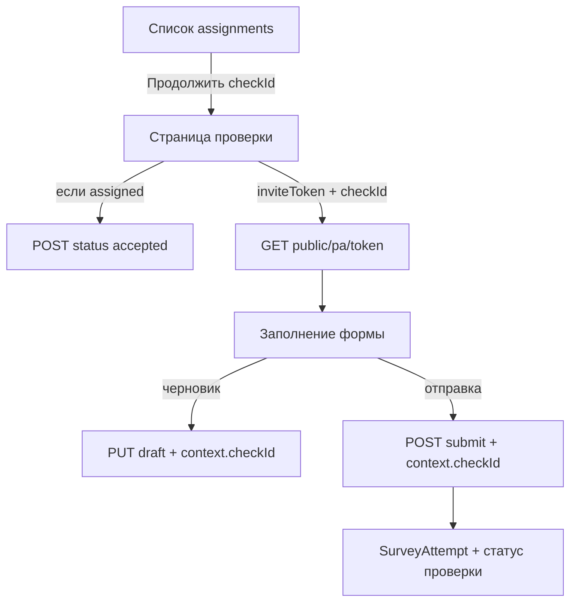

# Анализ: заполнение проверки аудитором (check survey flow)

**Ветки:** `feature/check-survey-flow`  
- фронт: `d:\anketa\auditor_frontend`  
- бэк: `d:\anketa\anketka\backend`  

**Статус:** только анализ, без изменений API и без доработки UI (кроме уже существующих WIP на фронте).

**Цель продукта:** аудитор из списка «Мои Задания» открывает **конкретную** проверку → видит её данные → заполняет анкету → сохраняет черновик / отправляет ответы, привязанные к этой проверке.

**Ограничение:** текущие эндпоинты **не ломаем** и по возможности **не меняем**; новые — только аддитивно.

---

## 1. Что есть сейчас

### 1.1. Фронт (`auditor_frontend`)

| Что | Где | Как работает |
|-----|-----|--------------|
| Список заданий | `GET /api/v1/auditor/assignments` → `AssignmentCard` | Реальные данные с бэка |
| Кнопка «Начать / Продолжить» | `/auditor/assignments/{checkId}` | Переход по `checkId` |
| Страница проверки | `assignments/[checkId]/page.tsx` | **Мок** `getMockCheckSurvey(checkId)` — одна и та же анкета KVI, не данные кликнутой проверки |
| UI формы | `features/check-survey` | Shared: Input, SelectPicker, PillSwitch, ProgressBar, FileField |

**Проблема UX:** sticky-блок `.actions` сейчас `position: sticky`. Требование: блок действий должен быть **static** всегда (зафиксировать при следующей итерации UI, не в этом анализе).

### 1.2. Бэкенд — эндпоинты аудитора (`/api/v1/auditor`)

| Method | Path | Назначение |
|--------|------|------------|
| GET | `/auditor/assignments` | Список назначений + `inviteToken`, прогресс, статусы |
| POST | `/auditor/assignments/{project_id}/{check_id}/status` | `accepted` / `declined` → 204 |
| GET | `/auditor/projects/{project_id}/checks/{check_id}/revision-items` | Очередь доработок |
| PATCH | `…/revision-items/{case_id}` (+ `/full-cycle`) | Ответ на доработку |
| GET | `/auditor/map/markers`, `/map/filters` | Карта |
| POST/DELETE | `/auditor/map/claims` | Заявки на свободные |

### 1.3. Есть ли GET одной проверки?

**Нет.** Отдельного `GET /auditor/assignments/{checkId}` (или аналога) **не существует**.

Единственный read-model назначения для кабинета аудитора — **список** `GET /auditor/assignments`. В каждом элементе уже есть:

- `projectId`, `checkId`, `checkName`, `projectName`
- `surveyId`, `surveyTitle`, `surveyCategory`
- `status`, `checkStatus`, прогресс `itemsCompleted` / `itemsTotal`
- **`inviteToken`** — ключ к заполнению анкеты

Staff-эндпоинты (`/api/v1/projects/.../checks/...`) аудитору **нельзя** вызывать (другая auth).

### 1.4. Как на бэке устроено «заполнить и отправить»

Реальный пайплайн заполнения — **Public PA**, не кабинетный CRUD:

Prefix: `/api/v1/public`

| Method | Path | Роль |
|--------|------|------|
| GET | `/pa/{token}` | Схема анкеты (SurveyBuilder) |
| GET | `/pa/{token}/draft` | Черновик |
| PUT/POST | `/pa/{token}/draft` | Сохранить черновик |
| POST | `/pa/{token}/submit` | Отправить ответы → 204 |
| GET | `/pa/{token}/options`, `/offline-bundle` | Справочники / оффлайн |

**`inviteToken`:**

- создаётся в `get_or_create_assignment_invite`
- привязка: `(project_id, survey_id, auditor_id)`, purpose=`assignment`
- **не привязан к одному `checkId`** — один токен может обслуживать несколько проверок одного проекта+анкеты

**Привязка к конкретной проверке:** в `draft` / `submit` передаётся

```json
{ "context": { "checkId": "<uuid>" }, "answers": { ... }, "mode": "continue" | "finish" }
```

Бэкенд (`_extract_check_id_from_context`) обновляет нужный `ProjectCheck` / assignment.

Хранение ответов: `SurveyAttempt.answers` (JSONB), state `draft` | `submitted`.

**Гейт доступа PA:** assignment должен быть `accepted` | `in_progress` | `completed`; иначе 403. Просрочка → 403.

---

## 2. Целевой пользовательский поток



Смысл: **не дублировать** submit-логику в новых кабинетных эндпоинтах; переиспользовать Public PA + обязательно `context.checkId`.

---

## 3. Разрывы (gaps)

| Gap | Деталь |
|-----|--------|
| Нет GET by checkId | Deep-link `/assignments/{checkId}` без кэша списка не знает `inviteToken` / `projectId` |
| Мок ≠ реальность | `CheckSurveyDraft` (яблоки/молоко) ≠ SurveyBuilder с бэка |
| Token ≠ check | Без `context.checkId` ответы могут уйти «не в ту» проверку |
| Accept gate | «Начать» при `assigned` сначала требует accept |
| UI actions sticky | Нужно `static` — отдельно от API |
| Адрес ТТ / таймер | В `AuditorAssignmentItem` нет geo/адреса; на карте есть markers, в list — нет |

---

## 4. Варианты решения (без ломки текущих API)

### Вариант A — Zero new endpoints (только фронт)

**Идея:** при открытии страницы брать данные из уже загруженного `GET /assignments` (RTK cache) или повторно вызвать список и найти `item.checkId === checkId`.

**Плюсы:** ноль изменений бэка; быстро.  
**Минусы:** лишняя нагрузка на list; deep-link / refresh без кэша тянет весь список; форма всё равно должна уйти в PA-схему, а не в мок KVI.

**Когда выбирать:** прототип / короткий спринт, пока нет отдельного GET.

---

### Вариант B — Аддитивный GET одного назначения (рекомендуемый минимум на бэке)

**Новый** эндпоинт (существующие не трогаем):

```http
GET /api/v1/auditor/assignments/{check_id}
→ AuditorAssignmentItem   # тот же DTO, что элемент списка
```

Опционально алиас:

```http
GET /api/v1/auditor/projects/{project_id}/checks/{check_id}/assignment
```

Реализация: переиспользовать логику `list_assignments` / access-check для одной строки.

**Плюсы:** deep-link, чистый контракт, не ломает list.  
**Минусы:** всё равно нужна интеграция с Public PA для схемы/submit.

**Фронт:** страница грузит assignment → показывает meta → рендерит PA-форму / редирект.

---

### Вариант C — Convenience «PA session» (аддитивно)

```http
GET /api/v1/auditor/assignments/{check_id}/pa-session
→ {
    checkId, projectId, surveyId,
    inviteToken,
    assignmentStatus,
    publicPaBase: "/api/v1/public/pa/{token}"
  }
```

**Плюсы:** один round-trip для старта заполнения.  
**Минусы:** чуть больше поверхности API; дублирует поля assignment.

Имеет смысл **после** или **вместе** с B.

---

### Вариант D — Встроить заполнение целиком под `/auditor` (не рекомендуется сейчас)

Новые `GET/PUT/POST …/checks/{id}/survey` с auditor JWT, внутри вызов той же логики, что Public PA.

**Плюсы:** единый auth cookie, без публичного token в URL.  
**Минусы:** риск дублирования `public_pa.py`; больше работ; легче разъехаться с staff PA.

Оставить на phase 2, если продукт запретит публичный token во фронте кабинета.

---

### Вариант E — Редирект на внешний `/pa/{token}?checkId=…`

Карточка/страница только meta + кнопка «Открыть анкету» → Public PA UI (как уже задумано в map balloon).

**Плюсы:** минимальный фронт кабинета; submit уже работает.  
**Минусы:** другой UX/дизайн, уход из оболочки кабинета; demo-like in-app форма не совпадает.

---

## 5. Рекомендация

**Короткий срок (MVP без ломки API):**

1. **Вариант B** — `GET /auditor/assignments/{check_id}` (новый файл роутера, include в portal).  
2. На фронте: meta страницы из этого GET (или временно A).  
3. Заполнение: **переиспользовать Public PA** (embed или отдельный слой `features/check-survey` поверх SurveyBuilder), всегда слать `context.checkId`.  
4. Перед первым заполнением при `status=assigned` — существующий `POST …/status` (`accepted`).  
5. UI: actions → `position: static`; убрать зависимость от мок-KVI для prod-пути.

**Не делать:** менять контракт `GET /assignments`, invite uniqueness per-check без миграции, форк submit вне `public_pa`.

---

## 6. Сравнение вариантов

| Критерий | A List-only | B GET one | C PA-session | D Auditor survey API | E Redirect PA |
|----------|-------------|-----------|--------------|----------------------|---------------|
| Ломает старые API | Нет | Нет | Нет | Нет* | Нет |
| Deep-link | Слабо | Да | Да | Да | Да (через token) |
| Объём бэка | 0 | Малый | Малый | Большой | 0 |
| Объём фронта | Средний | Средний | Меньше glue | Большой | Малый |
| Единый submit | Через PA | Через PA | Через PA | Риск дубля | Через PA |
| UX кабинета | Полный | Полный | Полный | Полный | Частичный |

\*D не ломает, но дублирует логику.

---

## 7. Предлагаемый порядок работ (после согласования)

### Бэк `feature/check-survey-flow`

1. `GET /auditor/assignments/{check_id}` → тот же `AuditorAssignmentItem`.  
2. Тесты: 200 свой check, 404 чужой/нет, overdue/access.  
3. Не трогать list / status / map / public_pa.

### Фронт `feature/check-survey-flow`

1. Actions footer → `static`.  
2. Страница: загрузка assignment по `checkId` (B, или A как interim).  
3. Accept при необходимости.  
4. Интеграция draft/submit Public PA + `context.checkId`.  
5. Постепенный отказ от `mock-survey` (оставить только Storybook/demo).

---

## 8. Открытые вопросы продукту

1. Форма в кабинете должна **полностью повторять SurveyBuilder** (динамическая схема) или достаточно meta + iframe/redirect на PA?  
2. Нужен ли адрес ТТ / таймер на странице проверки в MVP (данных нет в list DTO)?  
3. Оффлайн: использовать `/pa/{token}/offline-bundle` или отложить?

---

## 9. Ключевые файлы

**Бэк**

- `app/api/routes/auditors/auditor_portal/list_assignments.py`
- `app/api/routes/auditors/auditor_portal/update_assignment_status.py`
- `app/api/routes/auditors/auditor_portal/shared.py` (`get_or_create_assignment_invite`)
- `app/api/routes/public_pa.py`
- `app/schemas/auditor_portal.py` (`AuditorAssignmentItem`)
- `app/models/survey_attempt.py`, `survey_invite.py`, `project_check_auditor_assignment.py`

**Фронт**

- `src/entities/assignment/api/assignment.api.ts`
- `src/entities/assignment/ui/assignment-card/*`
- `src/app/(private)/auditor/assignments/[checkId]/page.tsx`
- `src/features/check-survey/*`
- `src/entities/assignment/model/mock-survey.ts` (временный мок)

---

## 11. Решение (принято)

- Новый аддитивный эндпоинт: `GET /api/v1/auditor/assignments/{check_id}` → `AuditorAssignmentItem`
- Страница `/auditor/assignments/[checkId]` грузит его
- Заполнение/черновик/отправка — существующие `/api/v1/public/pa/{token}/…` с `context.checkId`
- При `status=assigned` перед PA — `POST …/status` (`accepted`)
